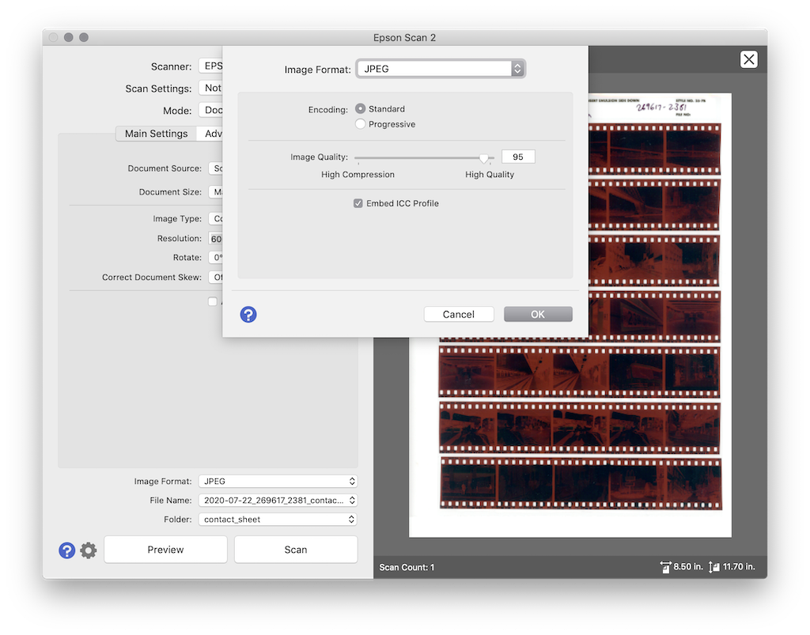

# How to make contact sheets from color film negatives

In this post I will detail methods on how to make contact sheets from 35mm film negatives.

There are a large variety of methods for making contact sheets depending on your circumstances and desired output.

Including a contact sheet with your film negatives can help you more easily view the contents of your stored film and facilitate lookup of specific images, or help you choose images you might want to scan or revisit later.

In the context of my own film processing workflow, I typically cut 35mm film into strips of 5 frames each, then scan each frame from each film strip on a flatbed scanner (Epson V600 & Epson Scan 2). Afterwards, the film is stored in archival sleeves (Print File 35-7B) labeled with date, film development order number, roll number, and short notes about location and subject. After a few years of shooting and scanning, I have ended up with two 3-ring binders filled with pages of film. However, storing the film like this makes it impossible to see the contents of each film strip. There is  also not much space for hand-written notes. That is where contact sheets come in. By including a contact sheet with each set of negatives, you can more easily see the film contents and leave extra notes.

The two methods I will show here for making contact sheets have their own pro's and con's. The steps involved should be easy to adapt to your own workflow.

## Setup

The following hardware and software will be used in this guide.

### From flatbed scanner

- 35mm film cut into strips, held in Print File film sleeve sheets
    - in our case, the film is cut into strips of 5 frames each in order to use Print File sleeves that fit a standard 8.5"x11" page
- flatbed scanner
    - I'm using an Epson V600 scanner
- (optional) light pad
- scanner software
    - I'm using [Epson Scan 2](https://epson.com/Support/Scanners/Perfection-Series/Epson-Perfection-V600-Photo/s/SPT_B11B198011), VueScan and/or SilverFast will also work
- image editing software
    - I'm using GIMP, Photoshop can also be used

### From pre-scanned images

- [Imagemagick](https://imagemagick.org/) software

# Methods

## From flatbed scanner

Overview:

- scan the full Print File film sleeve sheet with film negative strips on the flatbed scanner
- invert the negatives in photo editing software

In this method, we will be scanning the entire page of negatives on the large lower flatbed portion of the scanner (not the smaller upper "transparency adapter" present on the V600 and similar scanners).

The advantage to this is that you will get a contact sheet that exactly matches your film negative sheet. For example, the scanned film frames saved on your computer might be in a different order than originally on the film strip, or you might have skipped some frames entirely. You might also have some relevant information already written on the Print File sleeve that you want to retain. You will also be able to include the film borders, which often contains the film stock and frame numbers. In general, this method will give you the most exact replica of the film sheet that is sitting in your binder.

The disadvantage to this is that the process of creating such a contact sheet can be labor intensive and complicated (though there is the potential for automation in some steps and simplification via different software).

Most all of the steps shown here can be tweaked and adapted for your own personal workflow. For example, many film photographers perfer to use a digital camera to "scan" their negatives instead of a flatbed scanner or dedicated film scanner; this will work perfectly well with this method. Many people may also have copies of Photoshop or other software with extra built-in methods to facilitate contact sheet generation instead of using GIMP as shown here.

### Scan the negatives

The first step is to obtain a digital image from the full sheet of negative film strips.

We will accomplish this by performing a standard "reflective" scan with the V600 using the Epson Scan 2 software. Make sure that the white "document mat" is attached to the interior of the scanner lid.

Scan settings:

- Mode: Document Mode
- Document Source: Scanner glass
- Document Size: Maximum size
- Image Type: Color
- Resolution: 600 DPI

Output settings:

- Image format: JPEG
- Encoding: Standard
- Image quality: 95
- Embed ICC Profile

<figure>
<figcaption>Input settings</figcaption>
</figure>

<figure>
<figcaption>Output settings</figcaption>
</figure>

A scan resolution of 600 DPI is used here since that is likely the best quality output we will get from a standard printer later when we want go to print these pages out.

You should use the marquee tool in your scan software to crop the scan area down close to the edges of the film strips so you avoid including large amounts of white border in your saved image.

The final image in this case is about 8MB in size at a resolution of roughly 4500x6600 pixels.

<figure>
<figcaption>Film sheet on scanner</figcaption>
</figure>

As a side note, many scan softwares such as VueScan, SilverFast, and even Epson Scan are able to automatically invert the colors on negative film scans and apply quick and easy color corrections. Unfortunately, none of these softwares appear to be able to do this from the lower flatbed scanner, only from the upper film transparency scanner. If they could apply film negative inversions from the flatbed scan, then most all of the following steps would not be needed.

#### Optional: Light Pad

At this point, you can also use a light pad to help illuminate the film. This will help bring out details that the reflective scanner has trouble picking up such as the dense darker areas on the film which correspond to bright spots in your images.

In this image you can see that the scan preview shows a little more detail in the dark areas of the film while using the light pad. This will help give a better image quality in subsequent image editing steps

<figure>
<figcaption>Epson Scan input preview with light pad</figcaption>
</figure>

<figure>
<figcaption>Scanned image with lightpad</figcaption>
</figure>


### Edit the image

The next step is to start editing the image. For this, I am using GIMP since it is free. Most of the concepts here should carry over easily to other software like Photoshop.

Note that I currently have very little experience with GIMP so its very possible that better methods than those shown here exist.

Also note that even though the original image is a color negative, I will be converting it to black and white. There are two main reasons for this; black and white printing is cheaper and easier (I have a black and white laser printer at home), and editing the image color curves is vastly simpler in black and white.

The general overview of the whole process looks like this:

- import the scanned image
- crop out the label
- erase the white background
- invert the image
- subtract the film background color
- convert the image to black and white (monochrome grayscale)
- modify color curves
- reapply the label
- export the final image

#### Import the image and make starting layers

Open the scanned image in GIMP. I usually choose to keep the embedded color profile.

<!--  -->
<figure>
<figcaption>GIMP image import</figcaption>
</figure>

<!--  -->
<figure>
<figcaption>GIMP image imported</figcaption>
</figure>

This will add a new entry to the Layers panel with the image


<!-- <figure>
<figcaption>GIMP first layer</figcaption>
</figure> -->

For convenience, I like to make an extra copy of this layer (right click > Duplicate Layer), and then turn off visibility of the original layer (the eyeball button). Make sure you have the new duplicate layer selected in the list.


#### Crop out the label

Next I will crop out the upper label from the image. To do this I will first draw a box around it with the marquee tool (rectangle select tool), then remove the selected portion of the image by right clicking on the box and choosing Edit > Clear. By default, the currently selected background color will be shown instead (white in this case). However, I want to completely remove the image contents in this area, so I will right click on my current layer and select Add Alpha Channel. Now, if I Clear my selection box on the image a second time, I am left with only a transparent background in this area.

<!--  -->
<figure>
<figcaption>GIMP first clear</figcaption>
</figure>

<!--  -->
<figure>
<figcaption>GIMP add alpha</figcaption>
</figure>


<!--  -->
<figure>
<figcaption>GIMP second clear</figcaption>
</figure>

#### Erase white background

When you invert the image in the following steps, the white background surrounding the film strips will get turned to black. To reduce ink and toner usage during printing, we are going to remove some of this background.

Zoom in a little on the image, and use the Color Picker Tool with a radius set between 5 and 10 pixels to select the color of the white background behind the sprocket holes in the border of the film.


Make sure that the chosen color is set to the current foreground color.

Next, create a New Layer with the following attributes:

- Mode: Color erase
- Opacity: 100%
- Fill with: Foreground color


If it worked correctly, you should now be able to see transparency behind and around the film strips where the white pixels used to be. If you did not erase all the pixels this way, feel free to try adding more Color Erase layers with different selected tones from the image.

<!--  -->
<figure>
<figcaption>GIMP erase color white result</figcaption>
</figure>

NOTE: Make sure you remove the the selection rectangle from the canvas before the next step. It helps to do a Select All to get rid of it.

#### Invert the image

At this point, I like to make a "checkpoint" for my progress by making a new layer with "New From Visible". This way we can edit the image attributes without affecting previous layers. Turn off the visibility on all of the previous layers.


Next, go to Colors > Invert to apply the color inversion. It should look something like this:

<!--  -->
<figure>
<figcaption>GIMP invert</figcaption>
</figure>

#### Subtract film background color

Most color negative films have an orange colored background, which shows up as cyan after inverting the image. To remove some of this, I repeat the process from the previous steps, using the color picker to select the cyan color of the film between the frames and then apply a new layer to remove it from the image.

Select the color between frames and set it as the foreground color


Make a new layer with the following attributes:

- Mode: Subtract
- Opacity: 80%
- Fill with: Foreground color


The result should look something like this

<!--  -->
<figure>
<figcaption>GIMP image inverted with background removed</figcaption>
</figure>
#### Convert the image to black and white

At this point, you have some options: complete the image editing in its current color format, or convert the image to black and white. While it is possible to get good results from editing the colors of the image, I find that it is much simpler to do the remaining steps in black and white. Some guides suggest using tools such as Colors > Auto > White Balance at this step to continue editing in color, but I have not had satisfactory results with that method so far. So I will do the next steps in black and white.

Converting the image to black and white also presents some options. There are several different ways to perform the conversion, including:

- Image > Mode > Grayscale
- Colors > Desaturate > Color to Gray
- Colors > Desaturate > Mono Mixer

There are additional methods available, but these are the three that I focused on for testing. Converting the image mode to grayscale affects all image layers and reduces the image bit depth. Color to Gray is very computationally intensive (slow to run) and requires a lot of trial & error to get the best results. I found Mono Mixer to be relatively quick and easy and gave good results.

Before starting, I like to again make a new Layer From Visible, and turn off visibility of previous layers.


Next, pull up the menu for Colors > Desaturate > Mono Mixer

For this film sheet, I found mostly satisfactory results with the following settings:

- Red Channel Multiplier: 0.305
- Green Channel Multipler: -0.070
- Blue Channel Multiplier: 0.035
- Preserve luminosity

<!--  -->
<figure>
<figcaption>GIMP mono mixer settings</figcaption>
</figure>


You may need to tweak the settings a little for your own film, and may want to save your settings as a preset to apply more easily later. You may also consider applying Colors > Auto > Equalize at this step.

#### Modify color curves

Next we will want to adjust the color curves to enhance the representation of highlights, shadows, and mid-tones in the images.

From the menu, go to Colors > Curves. The color curve in its original default state looks like this:

<!--  -->
<figure>
<figcaption>GIMP defult color curve</figcaption>
</figure>


You will notice that the color channels for red, green, and blue are still listed; since we converted to black & white, we only need to worry about the "value" channel.

This graph shows a histogram along the bottom axis with the relative amounts of each color tone from dark (0; bottom and left) to light (255; top and right). Overlayed is a straight solid line stretching diagonally from the bottom left to upper right, with points at each end. These points represent the black point and white point, the darkest and brightest tones that will be included in the image. You will also notice that the histogram along the bottom does not fully extend across the entire x-axis to the white point, but stops short.

Fist, we will drag the white point at the upper right over to the left a little until it is closer to the right-most edge of the histogram. This will brighten up the whitest parts of the image. Do not go too far to the left or you will start clipping and losing image data.

<!--  -->
<figure>
<figcaption>GIMP adjust highlight point</figcaption>
</figure>


Next, we want to pull the curve downwards so that it is no longer a straight line, but instead tracks closer to the contour of the histogram. For this, I click on the color curve line approximately 1/4 to 1/3 of the way to the left from the white point, and drag it downwards. This brings down the intensity of the brighter regions of the image, making some faint details more visible.

<!--  -->
<figure>
<figcaption>GIMP adjust first curve point</figcaption>
</figure>

Likewise, I do the same on the other end of the line closer to the black point. Less adjustment is needed here, and may not be neccessary as per your preferences. Pulling down this area slightly makes the shadows a little darker, which helps increase contrast in the images. Do not go too far or spend too much time with it, because we will ultimately be limited by the dynamic range output of our commodity printer.

<!--  -->
<figure>
<figcaption>GIMP adjust second point</figcaption>
</figure>

The final result will look something like this:

<!--  -->
<figure>
<figcaption>GIMP color corrected</figcaption>
</figure>

#### Reapply the label

The original label from the film sleeve is helpful to have since it includes the handwritten notes and identifiers. However we want it to print out in its original white color in order to save toner/ink when printing.

A really simple solution for this is to just turn back on the visibility of the very first image layer that we imported, which contains the unedited scanned image. This will also fill in the transparent background behind the film strips with white again, which is OK at this point since we are printing on white paper anyway.

<!--  -->
<figure>
<figcaption>GIMP corrected image with source layer enabled</figcaption>
</figure>

#### Export the final image

Finally, save the finished image by going to File > Export.

<!--  -->
<figure>
<figcaption>GIMP export</figcaption>
</figure>


The finished image looks something like this:

<!--  -->
<figure>
<figcaption>Final contact sheet</figcaption>
</figure>

Print out the resulting image, and your contact sheet is complete!

<figure>
<figcaption>Film sheet and contact sheet</figcaption>
</figure>

#### With light pad

We can repeat the entire process with the image scanned with the light pad.

<!--  -->
<figure>
<figcaption>Final contact sheet with light pad</figcaption>
</figure>

You can see that the shadows and mid tones in the images were not affected much by the addition of the light pad during scanning, but the heavily exposed (and over exposed) highlights retained extra details.

## From pre-scanned images

Now, after spending all that time making contact sheets from scanned pages and GIMP editing, we will consider an easier method. You can use the frames you have already scanned from the film to create a contact sheet with ImageMagick's `montage` program.

In your terminal, first change to a directory with your source images in it;

```
$ cd my_film_scans

$ ls -1
img001.tif
img002.tif
img003.tif
img004.tif
...

```

Run the command to make a contact sheet;

```
$ magick montage *.tif montage_1.jpg
```

The output will look like this:


However we want to adjust the output, so we will use the following settings:

```
$ magick montage -tile 5 -geometry "480x480+20+2" -pointsize 36 -title "my_film_scans" *.tif montage_2.jpg
```

These settings include:

- `-tile 5`: five images per row
- `-geometry "480x480+20+2"`: thumbnail size 480 pixels with 20 pixels padding horizontally
- `-pointsize 36`: size 36 font for the title
- `-title "my_film_scans"`: text label at the top of the page

The output looks like this:

<!--  -->
<figure>
<figcaption>montage 2</figcaption>
</figure>

Wow, that was so much easier than before!

We can even write a simple `bash` shell script to do this for every subdirectory in the current directory.

I have included two example bash scripts in this repo;

- `make_contact_sheets.sh`: script to make ImageMagick `montage` contact sheets from all .tif images in all subdirs in the current directory

- `make_contact_sheets_pages.sh`: the same as above except it only runs on dirs with less than 41 images and makes multiple pages of contact sheets with 40 images each

NOTE: these scripts make use of Python and GNU `parallel`.

# Printing

There is not too much to say in regards to printing. Since we are planning to print a contact sheet for every roll of film you've ever shot (and I am sure you have shot hundreds of film rolls by now) you will likely want to use the cheapest and most readily available printing method possible. For me, that means using a simple HP Laserjet printer.

Note that throughout this guide, we have targetted a resolution of roughly 600DPI, which should be easily in the realm of your standard desktop laser printer. Make sure your printer is set to this output setting or higher. Also consider evaluating any eco-mode or lighter printing settings you might have available.

If you are using the GIMP edited contact sheets, the methods shown here made a best effort to reduce unnecessary black areas on the page to reduce toner usage. For the ImageMagick montage contact sheets, the output page will be in color but you can just let it print in black and white.

# Conclusion

The methods in this guide are intended for producing "good-enough" quality contact sheets to supplement your film archives. I hope these methods are helpful!

# Software

- [Epson Scan 2](https://epson.com/Support/Scanners/Perfection-Series/Epson-Perfection-V600-Photo/s/SPT_B11B198011) (listed under `Scanner Driver and Epson Scan 2 Utility`)
- [GIMP](https://www.gimp.org/) version 2.10.14
- [ImageMagick](https://imagemagick.org) 7.0.8

# Hardware

- [Epson V600 scanner](https://epson.com/For-Home/Scanners/Photo-Scanners/Epson-Perfection-V600-Photo-Scanner/p/B11B198011) ($250)
- [comzler Light Board A4 Tracing Light Box](https://www.amazon.com/dp/B07VF42DDB) ($20)
- Print File Archival 35mm Negative Preservers 35-7B (7 strips of 5 frames)

# References

- ["How to convert film negatives into digital contact sheets using a digital camera" by  PandaPix](https://www.youtube.com/watch?v=klZrJ9o6C3o)
- ["Manual Inversion of Color Negative Film" by Alex Burke Photography](https://www.alexburkephoto.com/blog/2019/10/16/manual-inversion-of-color-negative-film)
- ["4x5 negative scanning with an Epson V500/V550/V600" by -s-e-e-k-](https://www.reddit.com/r/AnalogCommunity/comments/qb44wj/4x5_negative_scanning_with_an_epson_v500v550v600/)
- ImageMagick `montage` [manual](https://imagemagick.org/script/montage.php) and [usage guide](https://legacy.imagemagick.org/Usage/montage/)
- [Create a Contact Sheet in Photoshop](https://helpx.adobe.com/nz/photoshop/how-to/create-contact-sheets.html)
- GIMP helpful pages
    - <https://graphicdesign.stackexchange.com/questions/8057/using-gimp-can-you-erase-a-color>
    - <https://docs.gimp.org/2.10/en/gimp-tool-curves.html>
    - <https://graphicdesign.stackexchange.com/questions/120401/gimp-level-adjustment-as-layer-like-photoshop>
    - <https://www.gimp.org/tutorials/Color2BW/>
    - <https://askubuntu.com/questions/119949/in-gimp-how-do-i-make-part-of-image-transparent-manually>
    - <https://www.gimpusers.com/forums/gimp-user/20542-contact-sheet>
- ["Film Photography Intro Pt.3: Scanning" by  James Stevenson Photography](https://www.youtube.com/watch?v=0se_9MxDSoM)
- ["Automate Editing in GIMP"](https://www.gimp.org/tutorials/Automate_Editing_in_GIMP/)
